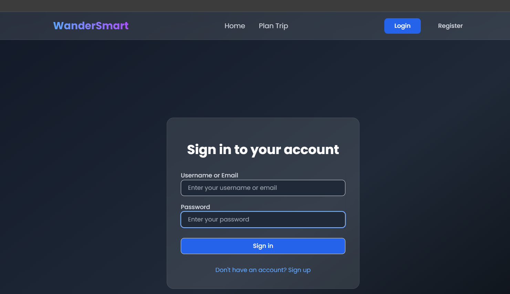
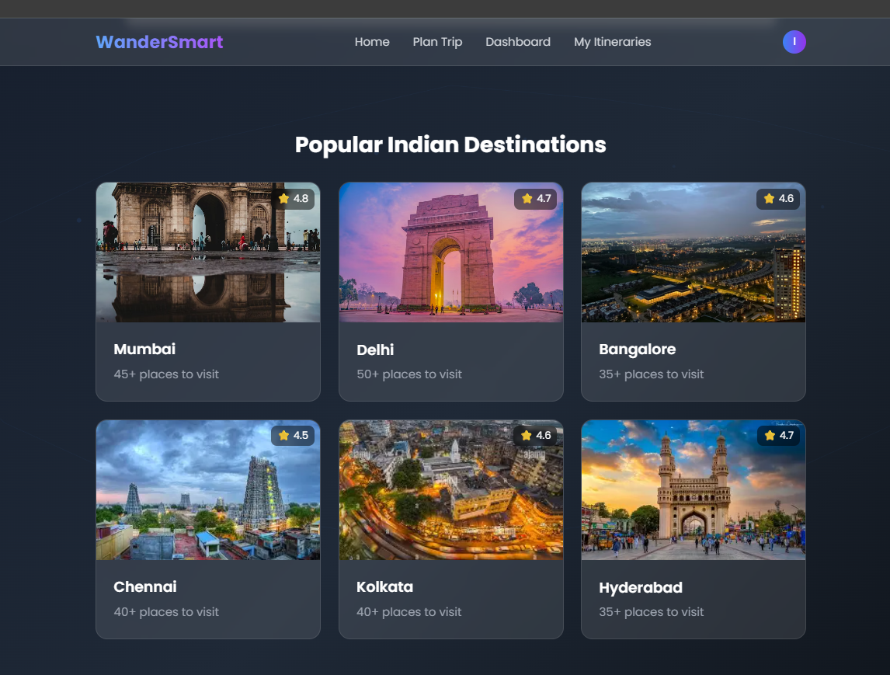
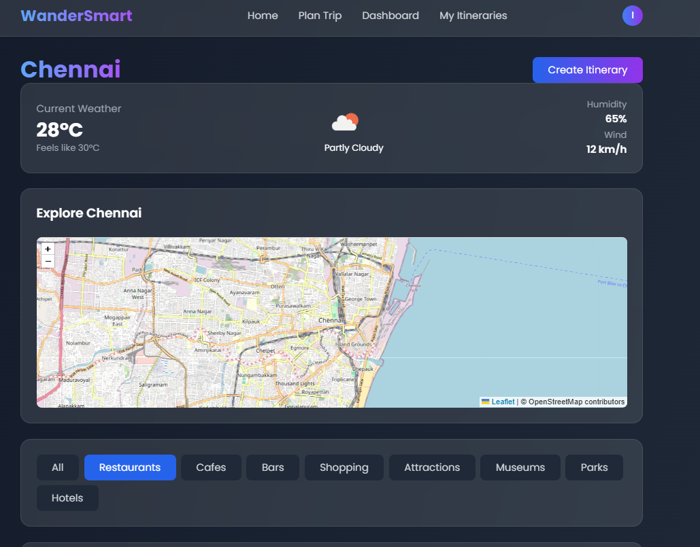
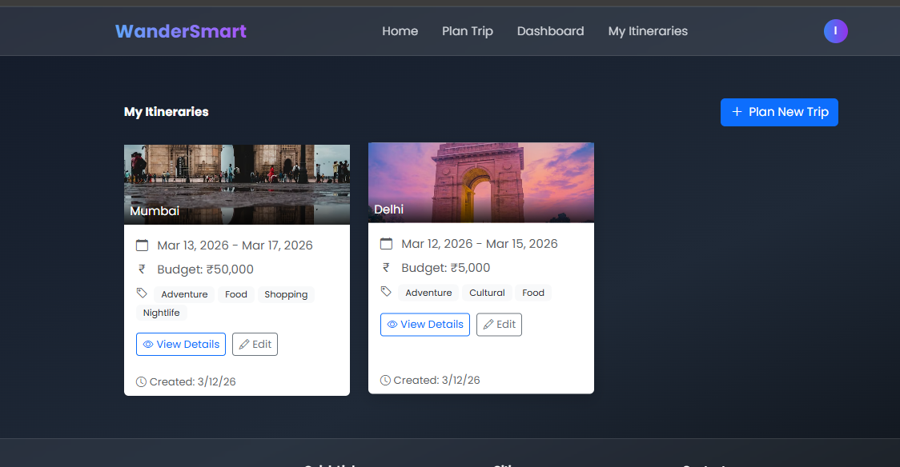

# 🌍 WanderSmart – Smart Travel Planner


---

## 📌 Project Description

**WanderSmart** is a full-stack web application that helps travelers plan their perfect trips.
It provides city information, travel itineraries, local attractions, and images using **AI-powered recommendations**.

This project demonstrates full-stack development with **Angular, ASP.NET Core, MongoDB**, and **external APIs** like **Unsplash, Pexels, Geoapify**.

---

## 🚀 Features

### ✅ Implemented Features

* **User Authentication** – Register, login, and secure sessions with JWT
* **City Information** – Detailed attractions, food, transport, and statistics
* **Image Services** – Unsplash & Pexels integration for high-quality images
* **Itinerary Management** – Create, read, update, delete itineraries
* **AI-Powered Itinerary Generation** – Smart recommendations based on user preferences
* **Real-Time Notifications** – Using SignalR
* **MongoDB Storage** – Flexible NoSQL database for all data

---

## 🛠 Tech Stack

### 🖥 Frontend


* Angular 17
* HTML / CSS / TypeScript
* Tailwind CSS
* RxJS (State Management)
* Leaflet (Maps)

### ⚙️ Backend


* ASP.NET Core (.NET 8.0)
* C# 12
* Swagger / OpenAPI 3.0
* SignalR (Real-time)
* Serilog (Logging)

### 🗄 Database


* MongoDB 7.0
* MongoDB Compass

### 🔗 External APIs


* Unsplash – City images
* Pexels – Destination images
* Geoapify – Geocoding & places

---

## 📂 Project Structure

```bash
WanderSmart/
├── frontend/
│   ├── src/
│   │   ├── app/
│   │   │   ├── pages/
│   │   │   │   ├── login/
│   │   │   │   ├── dashboard/
│   │   │   │   ├── citypage/
│   │   │   │   ├── categories/
│   │   │   │   └── itineraries/
│   │   │   ├── services/
│   │   │   └── models/
│   │   └── assets/
│   └── angular.json
├── backend/
│   ├── Controllers/
│   ├── Services/
│   ├── Models/
│   ├── Repositories/
│   └── wanderSmart.Backend.csproj
├── screenshots/
│   ├── login.png
│   ├── dashboard.png
│   ├── citypage.png
│   ├── categories.png
│   └── itineraries.png
├── README.md
└── .gitignore
```

---

## 📸 Screenshots

## 📸 Screenshots

## 📸 Screenshots

### Login Page


### Dashboard


### City Page


### Categories Page


### Itineraries Page


---

## ⚙️ Installation

### 1️⃣ Clone the Repository

```bash
git clone https://github.com/sasichintada/WanderSmart.git
cd WanderSmart
```

### 2️⃣ Install Frontend Dependencies

```bash
cd frontend
npm install
```

### 3️⃣ Restore Backend Packages

```bash
cd ../backend
dotnet restore
```

### 4️⃣ Configure Environment

* Add your **API keys** in `frontend/src/environments/environment.ts` or `environment.local.ts` for:

  * Unsplash
  * Pexels
  * Geoapify
* Add MongoDB connection string in `backend/appsettings.json`

### 5️⃣ Run the Application

```bash
# Backend
cd backend
dotnet run

# Frontend
cd ../frontend
ng serve
```

---

## ▶️ Usage

1. Open `http://localhost:4200` in your browser
2. Signup / Login
3. Explore dashboard and city information
4. Browse categories and images
5. Create or view itineraries

---

## 🔮 Future Improvements

* Search functionality for cities and itineraries
* User reviews and ratings
* Bookmark favorite itineraries
* Admin panel for managing cities and images

---

## 👩‍💻 Author

**Sasi Chintada**

---

